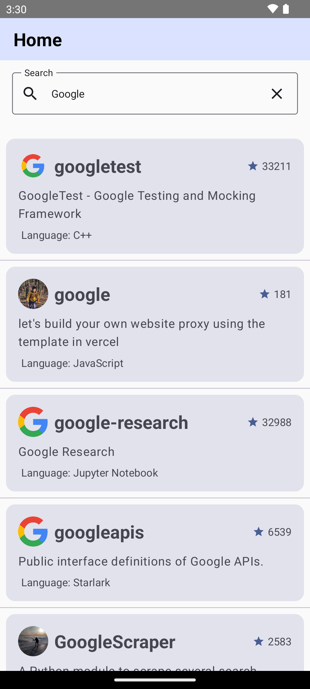
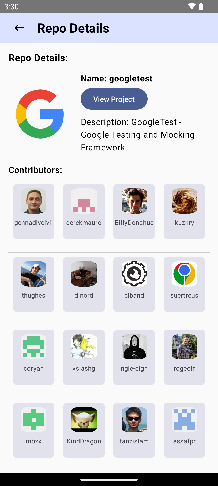
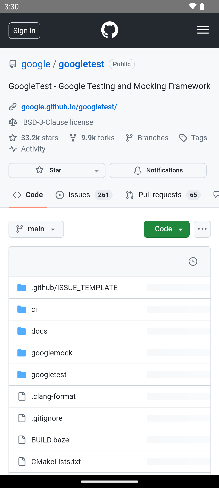

# GitHub Repository Search App

This is a mobile application built using the GitHub API to search through repositories. It allows users to search for repositories, view repository details, and explore contributors and their repositories.

## Features

- Search for repositories using the GitHub API.
- Pagination to limit the number of search results displayed.
- View details of a selected repository including name, description, contributors, and project link.
- Save the first 15 items' data offline for offline usage.
- View contributors of a repository and explore their other repositories.
- Utilizes Coroutines, LiveData, Room, MVVM architecture, and JetPack libraries.

## Screenshots

<div style="display: flex; flex-direction: row;">
    
    
    
</div>


## Installation

Download the APK file from the [Releases](app/release/app-release.apk) section and install it on your Android device.

## Usage

1. Open the app on your Android device.
2. Use the search bar to search for repositories.
3. Click on a repository to view its details.
4. On the repository details screen, you can click on the project link to open it in a WebView.
5. You can also explore the contributors and their repositories by clicking on their names.

**Important Note**: Since there is a limitation to use the GitHub API without a key, you need to obtain a GitHub API key and add it to the project. Please follow the GitHub API documentation to obtain your key and add it to the appropriate place in the code.

### Adding GitHub API Key to `secrets.properties`

To add your GitHub API key to the project, follow these steps:

1. Create a file named `secrets.properties` in the root directory of the project if it doesn't exist.
2. Open the `secrets.properties` file.
3. Add the following line to the file, replacing `YOUR_GITHUB_API_KEY` with your actual GitHub API key:

   ```properties
   GITHUB_API_KEY=YOUR_GITHUB_API_KEY

## Development

To build and run the project locally, follow these steps:

1. Clone this repository: `git clone https://github.com/Sharma-Prince/RepoHunt.git`
2. Open the project in Android Studio.
3. Build and run the project on an emulator or physical device.

## Dependencies

- Retrofit: For making network requests to the GitHub API.
- Room: For local database storage.
- ViewModel and LiveData: For managing UI-related data.
- JetPack libraries: For architecture components like ViewModel and LiveData.
- Espresso: For UI testing.
- JUnit: For unit testing.

## Contributing

Contributions are welcome! If you have any suggestions, bug fixes, or feature requests, please open an issue or submit a pull request.

## License

This project is licensed under the [MIT License](LICENSE).
